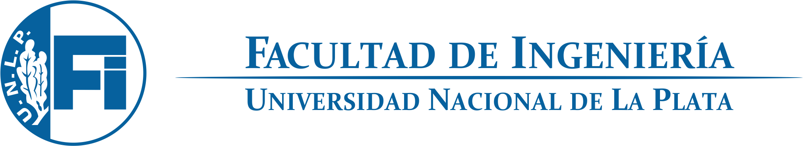
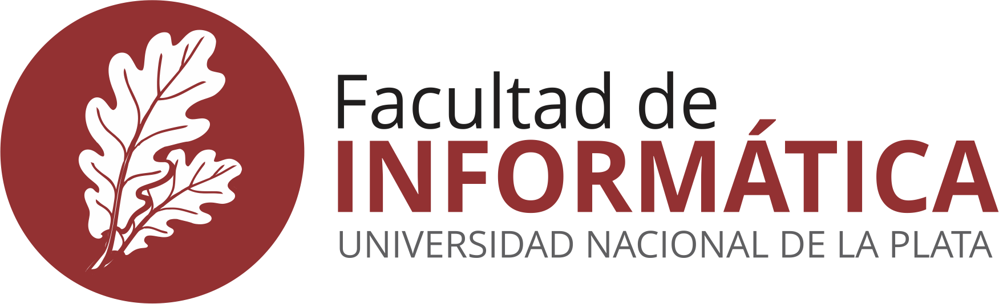
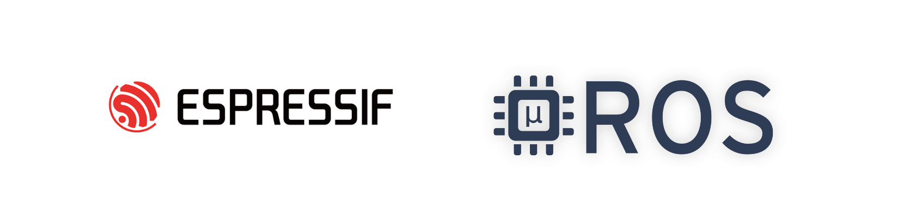

# Proyecto A3 - Portación μROS al ESP32
Este proyecto busca documentar la portación de μROS al ESP32. Analizar sus posibilidades y sus limitantes utilizando un ejemplo simple de control de un auto con 3 ruedas utilizando una ESP32.

# Arquitectura de la solución

# 📖 Bitácora
Acá subiremos las actualizaciones semanales con respecto a los avances del proyecto.

[👉 Enlace](https://github.com/tpII/2023-A3-ROS-ESP32/wiki/%F0%9F%93%96-Bit%C3%A1cora-de-Proyecto)

# ✒️ Autores 

* **Matías Manuel Zeballos** - 

* **Sabrina Luz Lombardo** - 
  
*  **Agustín Poire** - 

# 📌 Coordinador 

* **Alan Castelli** - *Profesor Taller de Proyecto II* - 

# 📄 Licencia 

Este proyecto está bajo la Licencia  GPL-3.0 license  
Mira el archivo [LICENSE](LICENSE) para detalles
